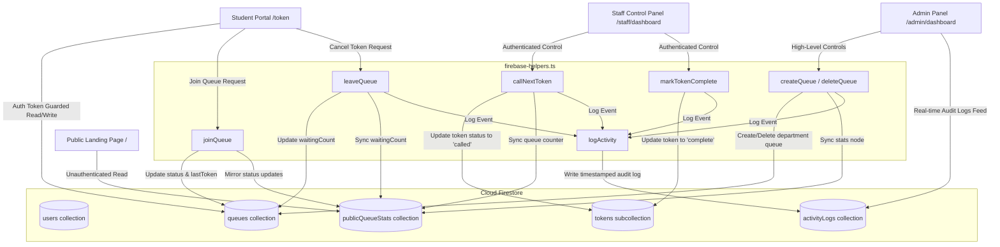

# SmartQueue — Virtual Queue Management System

SmartQueue is a virtual queue management system designed for GH Raisoni College (Jalgaon) to optimize student services. Students can skips physical counter lines by requesting queue tokens from their mobile phones, viewing their position in real-time, and heading to the counter only when called. Staff can call and complete tickets, while admins have full overview of queue performance, metrics, and system audit logs.

---

## 1. System Architecture Diagram

The system separates public directory stats from private student/staff data to ensure high security and optimal landing page rendering performance.



---

## 2. Firestore Security Model

Database security is enforced at the Cloud Firestore database layer utilizing rules defined in [firestore.rules](file:///c:/Users/lenovo/smartqueue/firestore.rules). Access controls are segmented by user roles:

*   **`users/{userId}`**: Owner read/write. Administrators can read/write all profiles.
*   **`publicQueueStats/{queueId}`**: Public read (no auth required for landing page counts). Write access restricted to staff and admins.
*   **`queues/{queueId}`**: Authenticated read only. Write access restricted to admins or staff members assigned directly to the department queue.
*   **`queues/{queueId}/tokens/{tokenId}`**: Authenticated read. Students can create or delete (leave) their own tokens. Staff assigned to that queue and admins can read, update, and manage all tokens in the subcollection.
*   **`activityLogs/{logId}`**: Admin read only. Write access allowed for authenticated operators to populate system actions.

---

## 3. Environment Variables

Create a `.env.local` file in the root directory and configure the following credentials from your Firebase Console:

```env
NEXT_PUBLIC_FIREBASE_API_KEY="your_api_key"
NEXT_PUBLIC_FIREBASE_AUTH_DOMAIN="your_project_id.firebaseapp.com"
NEXT_PUBLIC_FIREBASE_PROJECT_ID="your_project_id"
NEXT_PUBLIC_FIREBASE_STORAGE_BUCKET="your_project_id.appspot.com"
NEXT_PUBLIC_FIREBASE_MESSAGING_SENDER_ID="your_messaging_sender_id"
NEXT_PUBLIC_FIREBASE_APP_ID="your_app_id"
```

---

## 4. Prerequisites & Setup

Ensure you have **Node.js (v18+)** installed.

### Installation

Clone the repository and install dependencies:
```bash
npm install
```

### Run Development Server

Launch the Next.js local development server:
```bash
npm run dev
```
Open [http://localhost:3000](http://localhost:3000) in your web browser.

---

## 5. Production Compilation

Prior to deployment, verify typescript compilation and optimization outputs compile warning-free:

```bash
npm run build
```

The application compiles into static HTML and serverless actions optimization bundles.
